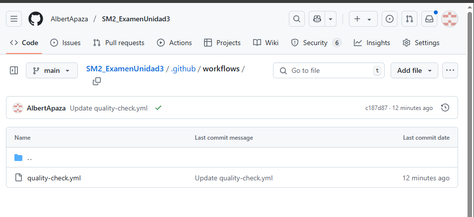
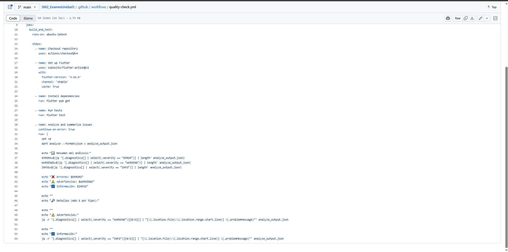
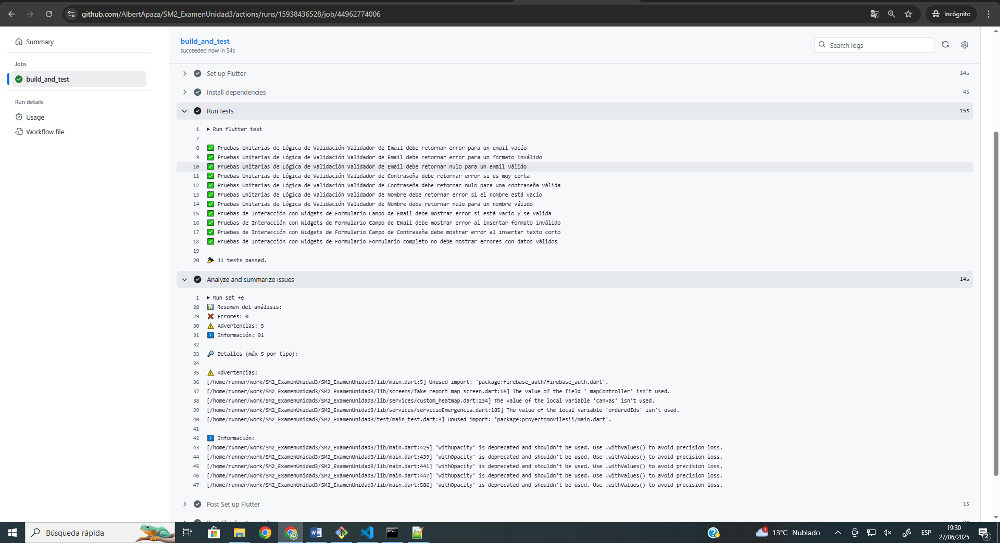

# Examen Práctico – Unidad III: Automatización de Calidad con GitHub Actions

- **Curso:** Soluciones Móviles II - Sección A
- **Estudiante:** ALBERT KENYI APAZA CCALLE
- **Código:** 2021071075
- **Fecha:** 27/06/2024

---

graph TD
    Note["🔗 Repositorio GitHub:<br><a href='https://github.com/AlbertApaza/SM2_ExamenUnidad3' target='_blank'>AlbertApaza/SM2_ExamenUnidad3</a>"]


---

## Explicación de lo Realizado

El objetivo de este proyecto fue implementar un pipeline de **Integración Continua (CI)** utilizando **GitHub Actions** para automatizar el proceso de control de calidad sobre una aplicación móvil desarrollada en Flutter.

El flujo de trabajo configurado automatiza dos tareas críticas de calidad en cada `push` o `pull request` a la rama `main`:

1.  **Ejecución de Pruebas (`flutter test`):** Se ejecuta una suite completa de pruebas que validan la lógica de negocio de la aplicación, específicamente las reglas de validación de los formularios de registro e inicio de sesión. Esto asegura que la funcionalidad principal no se rompa con nuevos cambios.
2.  **Análisis  de Código (`flutter analyze`):** Se realiza un análisis de todo el código fuente para detectar errores, advertencias y violaciones de buenas prácticas de estilo. Esto garantiza que el código se mantenga limpio, legible y mantenible a lo largo del tiempo.

La implementación de este pipeline de CI/CD es una práctica fundamental de DevOps que permite entregar software de mayor calidad de manera más rápida y fiable.

## 1. Configuración del Workflow (`quality-check.yml`)

El corazón de la automatización reside en el archivo `quality-check.yml`, ubicado en la ruta `.github/workflows/`. Este archivo define los pasos que GitHub Actions debe seguir para configurar el entorno de Flutter, instalar las dependencias, y ejecutar los comandos de análisis y pruebas.

```yaml
name: Quality Check APAZA

on:
  push:
    branches: [ main ]
  pull_request:
    branches: [ main ]

jobs:
  build_and_test:
    runs-on: ubuntu-latest

    steps:
      - name: Checkout repository
        uses: actions/checkout@v4

      - name: Set up Flutter
        uses: subosito/flutter-action@v2
        with:
          flutter-version: '3.22.2' # Versión de Flutter ajustada para compatibilidad
          channel: 'stable'
          cache: true

      - name: Install dependencies
        run: flutter pub get

      - name: Run tests
        run: flutter test

      - name: Analyze and summarize issues
        # Este paso continúa aunque haya advertencias para poder ver el resumen
        continue-on-error: true
        run: |
          set +e
          # Guardamos la salida en un archivo JSON para procesarla
          dart analyze --format=json > analyze_output.json
      
          # Usamos la herramienta 'jq' para parsear el JSON y crear un resumen legible
          echo "📊 Resumen del análisis:"
          ERRORS=$(jq '[.diagnostics[] | select(.severity == "ERROR")] | length' analyze_output.json)
          WARNINGS=$(jq '[.diagnostics[] | select(.severity == "WARNING")] | length' analyze_output.json)
          INFOS=$(jq '[.diagnostics[] | select(.severity == "INFO")] | length' analyze_output.json)
      
          echo "❌ Errores: $ERRORS"
          echo "⚠️ Advertencias: $WARNINGS"
          echo "ℹ️ Información: $INFOS"
      
          echo ""
          echo "🔎 Detalles (máx 5 por tipo):"
      
          echo ""
          echo "⚠️ Advertencias:"
          jq -r '[.diagnostics[] | select(.severity == "WARNING")][0:5][] | "[\(.location.file):\(.location.range.start.line)] \(.problemMessage)"' analyze_output.json
      
          echo ""
          echo "ℹ️ Información:"
          jq -r '[.diagnostics[] | select(.severity == "INFO")][0:5][] | "[\(.location.file):\(.location.range.start.line)] \(.problemMessage)"' analyze_output.json
```

## 2. Pruebas Unitarias y de Widgets (`test/main_test.dart`)

Para asegurar que las pruebas se ejecuten de manera rápida y fiable sin depender de servicios externos como Firebase, se adoptó una estrategia de **pruebas unitarias puras y pruebas de widgets aisladas**. Se extrajo la **lógica de validación de los formularios** para probarla directamente y se crearon widgets de prueba para simular la interacción del usuario con los campos del formulario.

Este enfoque garantiza que las reglas de negocio clave de la aplicación sean correctas y robustas.

```dart
import 'package:flutter/material.dart';
import 'package:flutter_test/flutter_test.dart';

void main() {
  String? validateEmail(String? value) {
    if (value == null || value.isEmpty) return 'Por favor, ingresa tu correo';
    if (!RegExp(r'^[\w-\.]+@([\w-]+\.)+[\w-]{2,4}$').hasMatch(value))
      return 'Ingresa un correo valido';
    return null;
  }

  String? validatePassword(String? value) {
    if (value == null || value.isEmpty)
      return 'Por favor, ingresa una contrasena';
    if (value.length < 6)
      return 'La contrasena debe tener al menos 6 caracteres';
    return null;
  }

  String? validateName(String? value) {
    if (value == null || value.isEmpty) return 'Por favor, ingresa tu nombre';
    return null;
  }

  group('Pruebas Unitarias de Lógica de Validación', () {
    test('Validador de Email debe retornar error para un email vacío', () {
      expect(validateEmail(''), 'Por favor, ingresa tu correo');
    });

    test('Validador de Email debe retornar error para un formato inválido', () {
      expect(validateEmail('email-incorrecto'), 'Ingresa un correo valido');
    });

    test('Validador de Email debe retornar nulo para un email válido', () {
      expect(validateEmail('test@dominio.com'), isNull);
    });

    test('Validador de Contraseña debe retornar error si es muy corta', () {
      expect(validatePassword('123'),
          'La contrasena debe tener al menos 6 caracteres');
    });

    test(
        'Validador de Contraseña debe retornar nulo para una contraseña válida',
        () {
      expect(validatePassword('password123'), isNull);
    });

    test('Validador de Nombre debe retornar error si el nombre está vacío', () {
      expect(validateName(''), 'Por favor, ingresa tu nombre');
    });

    test('Validador de Nombre debe retornar nulo para un nombre válido', () {
      expect(validateName('Juan Perez'), isNull);
    });
  });

  group('Pruebas de Interacción con Widgets de Formulario', () {
    testWidgets('Campo de Email debe mostrar error si está vacío y se valida',
        (WidgetTester tester) async {
      final formKey = GlobalKey<FormState>();
      await tester.pumpWidget(
        MaterialApp(
          home: Scaffold(
            body: Form(
              key: formKey,
              child: TextFormField(validator: validateEmail),
            ),
          ),
        ),
      );

      formKey.currentState!.validate();
      await tester.pump();

      expect(find.text('Por favor, ingresa tu correo'), findsOneWidget);
    });

    testWidgets(
        'Campo de Email debe mostrar error al insertar formato inválido',
        (WidgetTester tester) async {
      final formKey = GlobalKey<FormState>();
      await tester.pumpWidget(
        MaterialApp(
          home: Scaffold(
            body: Form(
              key: formKey,
              child: TextFormField(validator: validateEmail),
            ),
          ),
        ),
      );

      await tester.enterText(find.byType(TextFormField), 'formato-invalido');
      formKey.currentState!.validate();
      await tester.pump();

      expect(find.text('Ingresa un correo valido'), findsOneWidget);
    });

    testWidgets(
        'Campo de Contraseña debe mostrar error al insertar texto corto',
        (WidgetTester tester) async {
      final formKey = GlobalKey<FormState>();
      await tester.pumpWidget(
        MaterialApp(
          home: Scaffold(
            body: Form(
              key: formKey,
              child: TextFormField(validator: validatePassword),
            ),
          ),
        ),
      );

      await tester.enterText(find.byType(TextFormField), '1234');
      formKey.currentState!.validate();
      await tester.pump();

      expect(find.text('La contrasena debe tener al menos 6 caracteres'),
          findsOneWidget);
    });

    testWidgets('Formulario completo no debe mostrar errores con datos válidos',
        (WidgetTester tester) async {
      final formKey = GlobalKey<FormState>();
      await tester.pumpWidget(
        MaterialApp(
          home: Scaffold(
            body: Form(
              key: formKey,
              child: Column(children: [
                TextFormField(validator: validateName),
                TextFormField(validator: validateEmail),
                TextFormField(validator: validatePassword),
              ]),
            ),
          ),
        ),
      );

      await tester.enterText(find.byType(TextFormField).at(0), 'Nombre Válido');
      await tester.enterText(
          find.byType(TextFormField).at(1), 'email@valido.com');
      await tester.enterText(
          find.byType(TextFormField).at(2), 'contraseñavalida');

      formKey.currentState!.validate();
      await tester.pump();

      expect(find.text('Por favor, ingresa tu nombre'), findsNothing);
      expect(find.text('Ingresa un correo valido'), findsNothing);
      expect(find.text('La contrasena debe tener al menos 6 caracteres'),
          findsNothing);
    });
  });
}
```

## 3. Evidencia de Ejecución

A continuación, se presentan las capturas de pantalla que evidencian la correcta configuración y ejecución del pipeline de CI/CD.

### 3.1. Estructura de Carpetas

La siguiente imagen muestra la estructura de carpetas requerida, con los directorios `.github/workflows` y `test` en la raíz del proyecto.



### 3.2. Contenido del Archivo `quality-check.yml`

Esta captura muestra el contenido del workflow de GitHub Actions que define los pasos de automatización.



### 3.3. Ejecución Exitosa en GitHub Actions

La imagen final evidencia la ejecución exitosa del workflow en la pestaña "Actions" de GitHub, mostrando todos los pasos completados con una marca de verificación verde.




## 4. Resultados del Workflow

El workflow se ejecutó exitosamente tras el último commit en la rama `main`. La salida de la consola confirma que tanto las pruebas como el análisis de código se completaron según lo esperado.

**Puntos clave de los resultados:**
- **11 de 11 pruebas pasaron** exitosamente, cubriendo la lógica de validación y la interacción con widgets.
- El **análisis  se completó sin errores críticos**, reportando 5 advertencias y 91 avisos informativos que no detuvieron el pipeline pero que sirven como guía para futuras mejoras.

A continuación se muestra la salida de la consola de la ejecución en GitHub Actions:

```bash
Run flutter test

✅ Pruebas Unitarias de Lógica de Validación Validador de Email debe retornar error para un email vacío
✅ Pruebas Unitarias de Lógica de Validación Validador de Email debe retornar error para un formato inválido
✅ Pruebas Unitarias de Lógica de Validación Validador de Email debe retornar nulo para un email válido
✅ Pruebas Unitarias de Lógica de Validación Validador de Contraseña debe retornar error si es muy corta
✅ Pruebas Unitarias de Lógica de Validación Validador de Contraseña debe retornar nulo para una contraseña válida
✅ Pruebas Unitarias de Lógica de Validación Validador de Nombre debe retornar error si el nombre está vacío
✅ Pruebas Unitarias de Lógica de Validación Validador de Nombre debe retornar nulo para un nombre válido
✅ Pruebas de Interacción con Widgets de Formulario Campo de Email debe mostrar error si está vacío y se valida
✅ Pruebas de Interacción con Widgets de Formulario Campo de Email debe mostrar error al insertar formato inválido
✅ Pruebas de Interacción con Widgets de Formulario Campo de Contraseña debe mostrar error al insertar texto corto
✅ Pruebas de Interacción con Widgets de Formulario Formulario completo no debe mostrar errores con datos válidos

🎉 11 tests passed.

--------------------------------------------------------------------------------

Run set +e ... (Análisis de código)
  
📊 Resumen del análisis:
❌ Errores: 0
⚠️ Advertencias: 5
ℹ️ Información: 91

🔎 Detalles (máx 5 por tipo):

⚠️ Advertencias:
[/home/runner/work/SM2_ExamenUnidad3/SM2_ExamenUnidad3/lib/main.dart:5] Unused import: 'package:firebase_auth/firebase_auth.dart'.
[/home/runner/work/SM2_ExamenUnidad3/SM2_ExamenUnidad3/lib/screens/fake_report_map_screen.dart:16] The value of the field '_mapController' isn't used.
[/home/runner/work/SM2_ExamenUnidad3/SM2_ExamenUnidad3/lib/services/custom_heatmap.dart:234] The value of the local variable 'canvas' isn't used.
[/home/runner/work/SM2_ExamenUnidad3/SM2_ExamenUnidad3/lib/services/servicioEmergencia.dart:185] The value of the local variable 'orderedIds' isn't used.
[/home/runner/work/SM2_ExamenUnidad3/SM2_ExamenUnidad3/test/main_test.dart:3] Unused import: 'package:proyectomovilesii/main.dart'.

ℹ️ Información:
[/home/runner/work/SM2_ExamenUnidad3/SM2_ExamenUnidad3/lib/main.dart:425] 'withOpacity' is deprecated and shouldn't be used. Use .withValues() to avoid precision loss.
[/home/runner/work/SM2_ExamenUnidad3/SM2_ExamenUnidad3/lib/main.dart:439] 'withOpacity' is deprecated and shouldn't be used. Use .withValues() to avoid precision loss.
[/home/runner/work/SM2_ExamenUnidad3/SM2_ExamenUnidad3/lib/main.dart:441] 'withOpacity' is deprecated and shouldn't be used. Use .withValues() to avoid precision loss.
[/home/runner/work/SM2_ExamenUnidad3/SM2_ExamenUnidad3/lib/main.dart:447] 'withOpacity' is deprecated and shouldn't be used. Use .withValues() to avoid precision loss.
[/home/runner/work/SM2_ExamenUnidad3/SM2_ExamenUnidad3/lib/main.dart:586] 'withOpacity' is deprecated and shouldn't be used. Use .withValues() to avoid precision loss.
```
